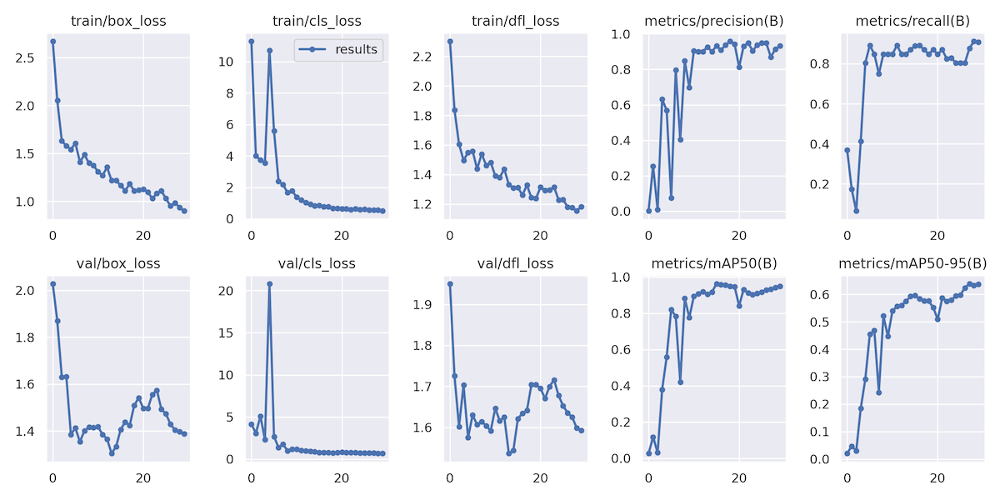
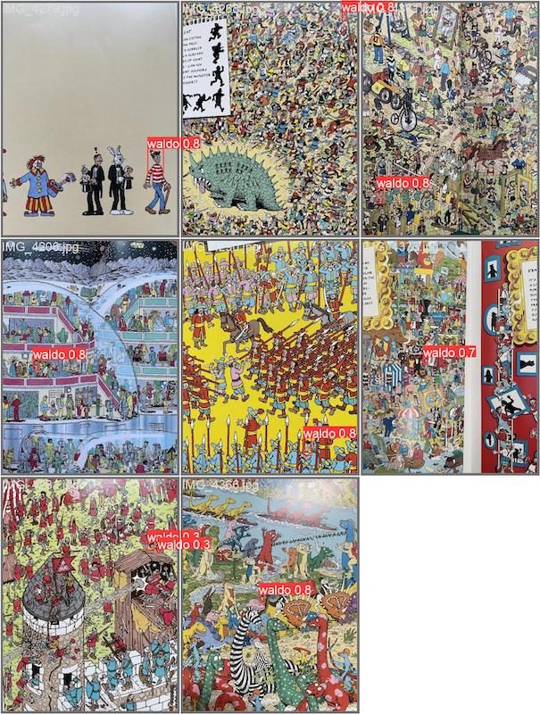

# README
This is the data and code behind training the ML object detection model for [findingwaldo.app](https://findingwaldo.app) 


## How-to
### Requirements
- python3 (preferred 3.10.x or newer)
- `pip install -r requirements.txt`

### Training
- get training data:
```
wget https://storage.googleapis.com/public-file-server/waldo_training_images.tar
wget https://storage.googleapis.com/public-file-server/waldo_validation_images.tar
```
- untar images into the train and validate folders respectively
```
python train.py
```
- use a larger pretrained model as your base
- sizes: nano, small, medium, large, extra large
- trade off is speed vs accuracy
- outputs to a new 'run' directory with models and graphs/metrics of each of your training runs

### Detection
```
python detect.py
```
- repo includes the nano sized model which finds Waldo with 0.54 confidence (vs 0.77 with a medium and 0.82 with xlarge) on the provided test image

## Stats/metrics of the current deployed model (XLarge)
- trained in [Vertex AI Workbench](https://cloud.google.com/vertex-ai-workbench) with **n1-standard-4** machine type with an NVIDIA Tesla T4 GPU

<a>

</a>
<a>

</a>
<a>

</a>
